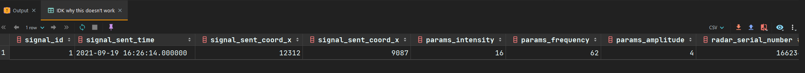

# Лабораторная работа #1

> Предмет: Информационные системы и базы данных

## Отчет по лабораторной работе
[Отчет PDF](extra/db-lab-1-report.pdf)

[Отчет на Google Drive (always the newest version)](
https://docs.google.com/document/d/1DQzyUpTiQTxwq1yFmifVrJIqzTDtW97LegijeUkhTaA/edit?usp=sharing)


## Защита лабораторной работы

### SQL запрос

#### Задание для запроса

1. Среди открытых космических тел найдите тело с наибольшей массой.
2. По этому телу найдите сигналы, которые его открыли.
3. Среди этих сигналов найдите сигнал с наименьшей амплитудой.
4. Выведите его параметры вместе с параметрами радара, который его отправил.

#### Реализация запроса
```sql

select
       signal_and_params.id as signal_id,
       sent_time as signal_sent_time,
       sent_coord_x as signal_sent_coord_x,
       sent_coord_y as signal_sent_coord_x,
       intensity as params_intensity,
       frequency as params_frequency,
       amplitude as params_amplitude,
       serial_number as radar_serial_number,
       ship_name as radar_ship_name,
       period as radar_period,
       explore_start_date as radar_explore_start_date
from
(
    with signal_and_params as
    (
        select signal.id, sent_time, sent_coord_x, sent_coord_y, radar_id, intensity, frequency, amplitude
        from
        (
            select *  -- opened the astro body signals
            from signal
            where
            (
                id in
                    (
                        select signal_id -- opened the astro body signals IDs
                        from discovered_astro_bodies
                        where astro_body_id =
                        (
                            select id -- the most heavy astro body ID
                            from astro_body
                            where mass =
                            (
                                select max( mass )
                                from astro_body
                            )
                        )
                    )
            )
        ) as signal
        join signal_params
        on signal.params_id = signal_params.id
    )
    select * -- ID of a signal with MIN amplitude
    from signal_and_params
    where amplitude =
    (
      select min(amplitude)
      from signal_and_params
    )
) as signal_and_params
join
radar on signal_and_params.radar_id = radar.id;

```
---
#### Результат выполнения запроса

